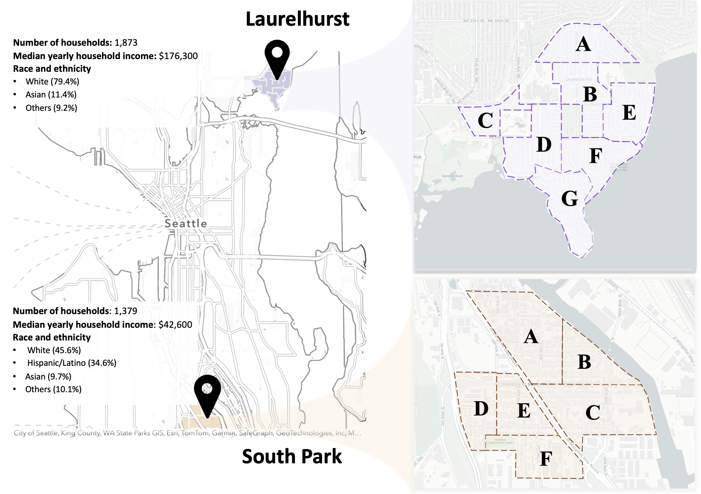
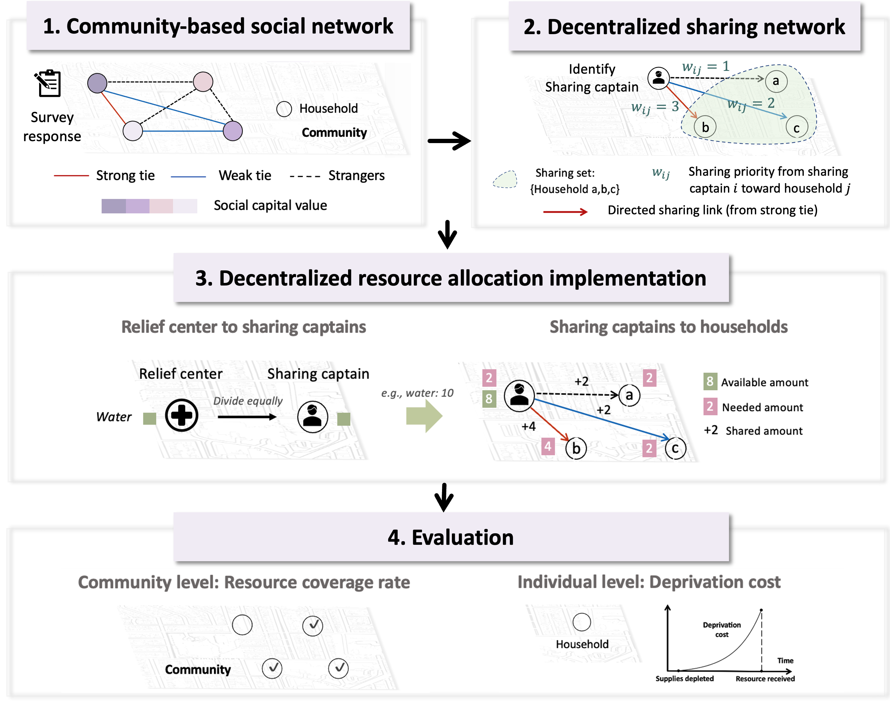

This repository hosts the simulation data and code for: **"The Efficacy of Decentralized Disaster Relief Resource Allocation Within Communities: The Role of Community-based Sharing Captains"**

Motivated by observations that neighbors naturally help each other during disasters, this study investigates a **decentralized resource allocation strategy**. We introduce **"Sharing Captains"**—residents who step up to distribute relief resources within their social networks --and compare this approach with traditional fixed-point distribution.

Using data from two communities in Seattle (**Laurelhurst** and **South Park**), we simulate the efficacy of this strategy in terms of deprivation costs and resource coverage.

Our framework consists of four steps

### 1. Community-based Social Network Construction
We construct complete social networks for the communities using survey data.

### 2. Decentralized Sharing Network
**Sharing Captains:** Selected based on criteria such as Social Capital 

**Sharing Sets:** Defined by sharing preferences 

### 3. Resource Allocation Implementation

### 4. Evaluation
**Resource Coverage Rate:** The percentage of households receiving resources over time
**Deprivation Cost:** An exponential function capturing human suffering due to resource shortages over time

The core code is located in the `code/` folder:

* ` Survey Response-South Park.ipynb`,` Survey Response - Laurelhurst.ipynb`: Survey analysis
* ` Generate social network-South park.ipynb
`,` Generate social network-Laurelhurst.ipynb`: Social network construction
* `centralized_main.py`: Simulation for centralized resource allocation
* ` decentralized_laurelhurst.py`,` decentralized_southpark.py`: Simulation for decentralized resource allocation

